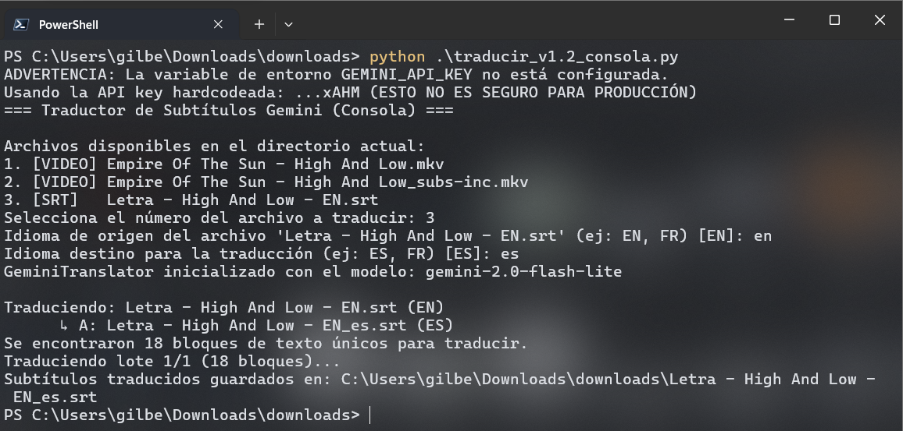
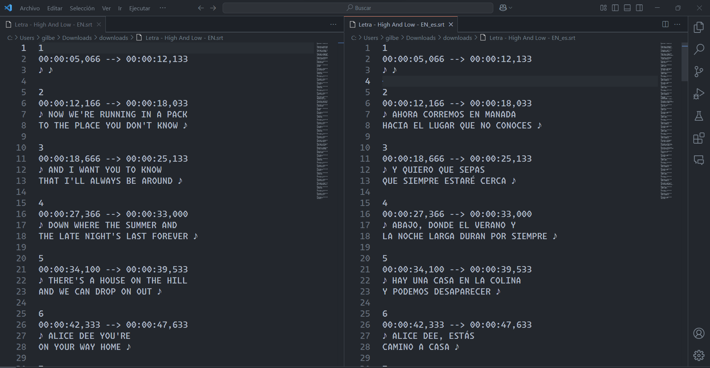

# HarmonySubs: Traductor de Subtítulos Musicales con IA 🎵🤖

Este script permite extraer, traducir y guardar subtítulos desde archivos de video o `.srt`, utilizando la API de Google Gemini. Está especialmente diseñado para subtítulos de canciones, manteniendo el tono poético y la emoción del texto original.

## Características principales

- 🎥 **Extracción automática de subtítulos** desde archivos de video (`.mkv`, `.mp4`, `.avi`, `.mov`) usando `ffmpeg`.
- 🧠 **Traducción con IA generativa** (Gemini), con manejo por lotes y control de errores.
- 🖥️ **Interfaz por consola** simple e intuitiva.
- 🎶 **Soporte especial para subtítulos musicales**, conservando ritmo y saltos de línea.
- ⚠️ **Manejo robusto de errores** (API, ffmpeg, archivos faltantes, etc.).

## Vista previa del proceso

| Proceso en consola | Subtítulos traducidos |
|--------------------|-----------------------|
|  |  |

## Requisitos

- Python 3.8 o superior
- `ffmpeg` instalado y en el PATH ([descargar aquí](https://ffmpeg.org/download.html))
- Librerías de Python:
  - `pysubs2`
  - `google-generativeai`

Instala las dependencias con:

```bash
pip install pysubs2 google-generativeai
```

## Configuración de la API Key

> ⚠️ **IMPORTANTE**: No incluyas tu API key directamente en el código. Usa variables de entorno.

Define la clave en tu consola (Windows PowerShell):

```powershell
$env:GEMINI_API_KEY="TU_API_KEY"
```

## Uso

1. Coloca el script en el mismo directorio que tus archivos de video o `.srt`.
2. Ejecuta:

```bash
python traducir_srt_song.py
```

3. Selecciona el archivo a traducir.
4. Si eliges un video, intentará extraer automáticamente los subtítulos.
5. Ingresa el idioma de origen y destino (por defecto: EN → ES).
6. El archivo traducido se guardará con sufijo de idioma (ej. `nombre_es.srt`).

## Detalles técnicos

- Traducción por lotes de 20 bloques únicos.
- Preserva saltos de línea y formato `.srt`.
- Fallback: si falla una traducción, se conserva el texto original.
- Compatible con subtítulos incrustados o externos.

## Notas

- La API de Gemini puede tener costos según tu cuota.
- El proyecto es para fines personales y educativos.
- Puedes adaptar el modelo o el batch size según tus necesidades.

## Créditos

Desarrollado por [Gilberto Nava] – con Gemini 2.5 Pro y o4-mini-high.

---

¿Dudas o sugerencias? Revisa los mensajes de error en consola o consulta la documentación de `pysubs2`, `ffmpeg` y `google-generativeai`.
